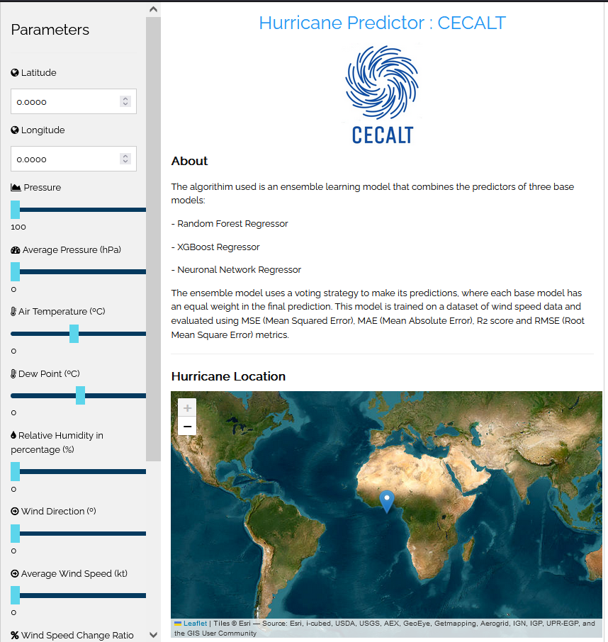
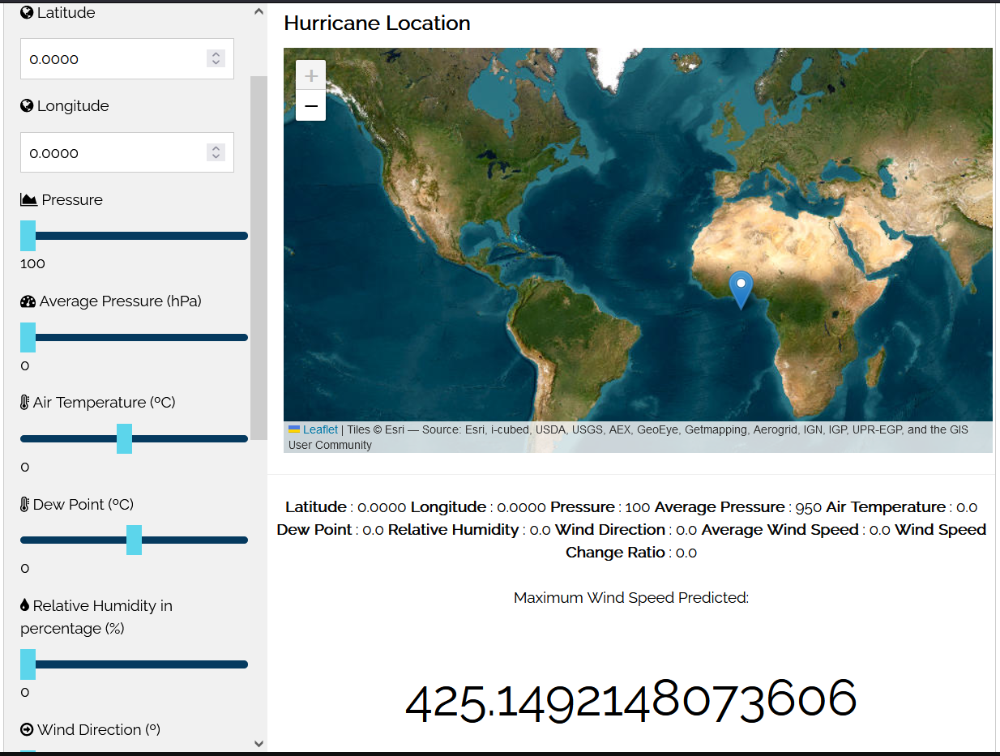
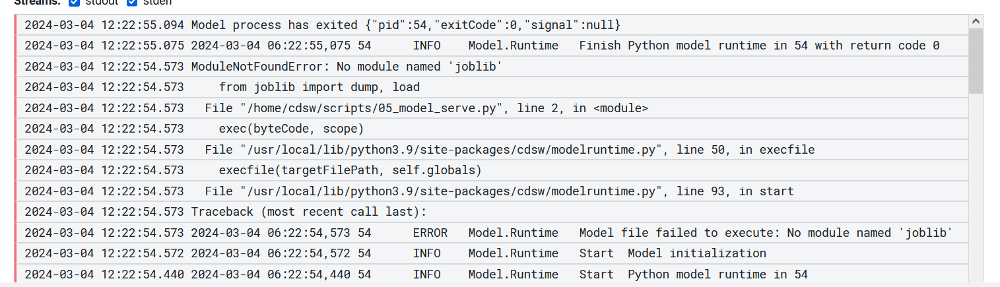
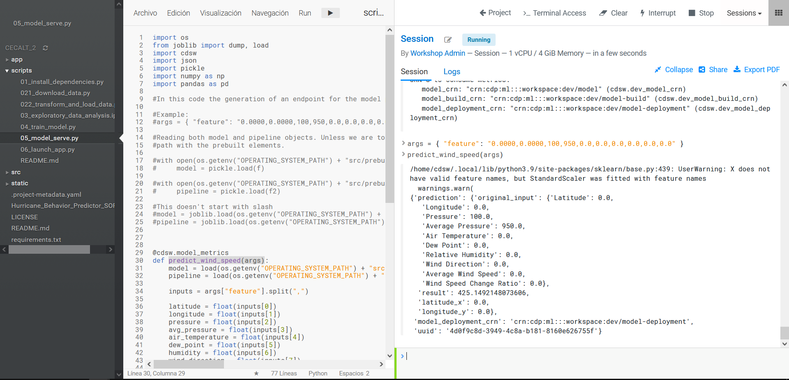

# CECALT (CEnter of meteorologiCAL Technology) 
This is an integral project whose objective is to increase the sensitivity of hurricane prediction systems. It contains all the code and data needed to deploy an end-to-end machine learning project on a running CML instance.



Its primary goal is to build an ensemble learning model that combines the predictors of three base models:

- Random Forest Regressor
- XGBoost Regressor
- Neuronal Network Regressor

To forecast the wind speed based on geographical and meteorological conditions, like in the following example: 



The ensembling model uses a voting strategy to make its predictions, where each base model has an equal weight in the final prediction.

This model is trained on a dataset of wind speed data and evaluated using MSE (Mean Squared Error), MAE (Mean Absolute Error), R2 score and RMSE (Root Mean Square Error) metrics.

The dataset used in this project comes from the [National Hurricane Center](https://www.nhc.noaa.gov/) and the [Meteostat Project](https://meteostat.net/en/), with the aid of [analysis and transformations](scripts/exploratory_data_analysis.ipynb). 


## Project Structure

The project is organized with the following folder structure:

```
.
├── app/            # Sources needed to launch the application
├── scripts/        # Scripts used for the creation and deploy of the end-to-end solution
├── src/            # All the prebuilt models and datasets necessary for the project
├── static/         # All images used in the project
├── README.md
├── Hurricane_Behavior_Predictor_SOP.docx
├── LICENSE.txt
└── requirements.txt

```
The file  `Hurricane_Behavior_Predictor_SOP.docx` contains a deeper walk-through of the project. 


## Deploying on Cloudera

The ways of executing the project are the following ones: 

1. **As AMP** - In a CML workspace, click "New Project", add a Project Name, select "AMPs" as the Initial Setup option, copy in the [repo URL](https://github.com/amcm329/cod_hurricane_prediction), click "Create Project", click "Configure Project"

2. **Manual Setup** - In a CML workspace, click "New Project", add a Project Name, select "Git" as the Initial Setup option, copy in the [repo URL](https://github.com/amcm329/cod_hurricane_prediction), click "Create Project". Then, follow the steps listed [in this document](scripts/README.md).


----
### **Note**
In general, the project contains mechanisms to guarantee a safe execution but if anything happens, it would be desirable to check both the documentation and the [technical configuration](scripts/README.md).

----
### **IMPORTANT**
The module corresponding to the model deploy has been disabled for the complete execution as it always throws the following error despite the library **joblib** being installed and imported already: 



But you can execute it manually and it works:




But if you want to execute the process individually, it works.
