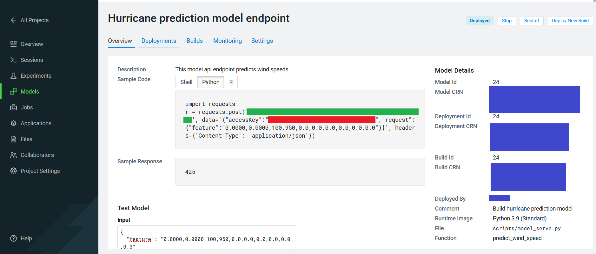

# Project Build Process

In order to execute the module manually, follow these steps. It is important to mention that, inside each one of the codes, there are explanations and hints on how to properly execute them.

----
### 01 - Install dependencies

**Note**: this step *must* be executed in the beginning.

Open the file `scripts/install_dependencies.py` in a normal workbench Python3 session. A 1 CPU / 2 GB instance is enough. Then **Run > Run All Lines**

----
### 02 - Download and clean data (Optional)

Open the file `scripts/transform_and_load_data.py` in a normal workbench Python3 session. A 2 CPU / 4 GB instance is desirable. Then **Run > Run All Lines**

**Note**: this step relies on the API Meteostat and because of it, a lag might be present.

**Note**: an environment flag **ETL_OPERATIONS** is related to this process.

**Note**: this process automatically calls `scripts/download_data.py`.

----
### 03 - Exploratory Data Analysis (Optional)

This is a Jupyter Notebook that does some basic data exploration and visualization. It is here to show how this would be part of the data science workflow.

Open a **JupyterLab** session: Python3, 2 CPU, 4 GB and open the `scripts/exploratory_data_analysis.ipynb` file. 

At the top of the page click **Cells > Run All**.

----
### 04 - Model Train

To run the model training process as a job, create a new job by going to the Project window and clicking _Jobs > New Job_ and entering the following settings:

* **Name**: Train Model
* **Script**: scripts/train_model.py
* **Arguments**: _Leave blank_
* **Kernel**: Python 3
* **Schedule**: Manual
* **Engine Profile**: 2 vCPU / 4 GiB

The rest can be left as is. Once the job has been created, click **Run** to start a manual run for that job.

**Note**: an environment flag **TRAIN_MODEL_FLAG** is related to this process.

---- 
### 05 - Model Serve

To deploy the model that was trained in the previous step: from  to the Project page, click **Models > New Model** and create a new model with the following details:

* **Name**: Hurricane prediction model API endpoint
* **Description**: This model api endpoint predicts wind speeds
* **File**: scripts/model_serve.py
* **Function**: predict_wind_speed
* **Kernel**: Python 3
* **Engine Profile**: 2vCPU / 4 GiB Memory

**Note**: an environment flag **USE_PREBUILT_MODEL** is related to this process.

----
### 06 - Application

CECALT application concatenates all analytical power with a simple yet powerful graphical interface. In order to enable it you must go to the **Applications** section and select "New Application" with the following:

* **Name**:  CECALT Application
* **Subdomain**: hurricane-prediction
* **Script**: scripts/launch_app.py
* **Kernel**: Python 3
* **Engine Profile**: 1vCPU / 2 GiB Memory

Then click "Create Application". After the Application deploys, click on the blue-arrow next to the name to launch the application in a new window.

----
**Note**: there is no automated way to connect both steps **model deployment** and **application**, in other words, if a model api connection wants to be established then step regarding **application** must be executed separately by following these instructions:

1.- Based on the model deployment, follow this site and copy the elements **model endpoint and access key (colors green and orange respectively)**.

2.- Go to the code **launch_app.py** and replace the mentioned values in this section:

3.- Execute step 06 - Application as usual.
